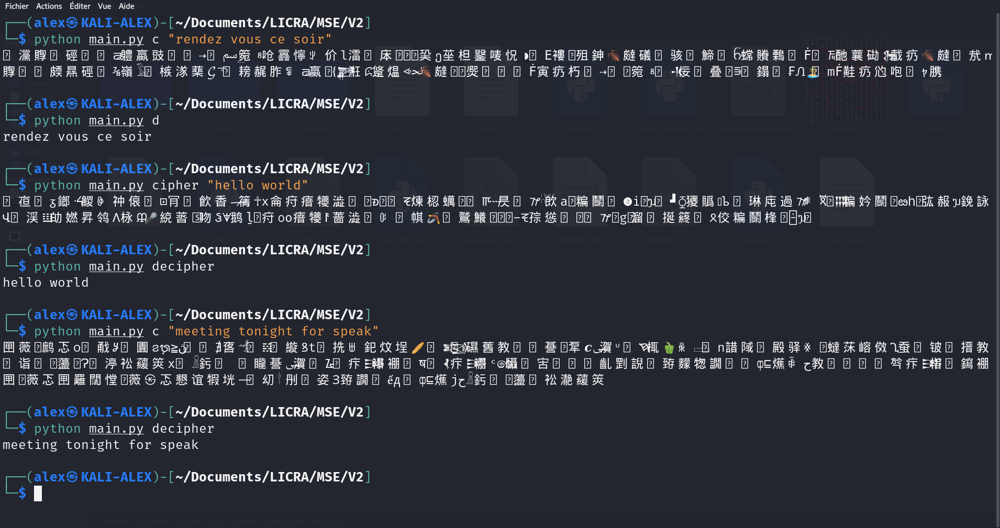

	███╗   ███╗  ██████╗ ███████╗
	████╗ ████║ ██╔════╝ ██╔════╝
	██╔████╔██║ ╚█████╗  █████╗
	██║╚██╔╝██║  ╚═══██╗ ██╔══╝
	██║ ╚═╝ ██║ ██████╔╝ ███████╗
	╚═╝     ╚═╝ ╚═════╝  ╚══════╝

# MSE PROJECT
-------------------------------------

# ENCRYPTION BY MUTILPLE SUBSTITUTION
-------------------------------------

Chiffrement par substitution multiple

projet sur un programme de chiffrement par substitution multiple,
pour but de créer des messages codés avec des phrases courtes.

**Normalement il faut avoir les clés de chiffrement pour pouvoir déchiffrer les messages de quelqu'un d'autre, normalement ! (Tentez de [casser les messages sans le programme](https://discord.gg/E6qJmmKaEW))**

**Attention si vous perdez vos clés, tous les messages que vous avez chiffrées précédemment seront plus possible à déchiffrer (comme si vous perdez vous bitcoin à jamais !**

Tous est facilement paramétrable dans le fichier **parametre.py**

Nom de version: **CRC VIII BETA**

---------------------------------------

# REQUIS
-------------------------------------
Pour copier le message automatiquement vous devez installez le module [pyperclip](https://pypi.org/project/pyperclip/)

	> pip install pyperclip
	
[pyAesCrypt](https://pypi.org/project/pyAesCrypt/) pour chiffrer et envoyer vos clés de chiffrement

	> pip install pyAesCrypt

	
-------------------------------------

**le fichier keylib.keys sont vous clés de chiffrement, gardez les secret à tous prix !**
Elle est générer lorsque vous chiffrer votre premier message

-------------------------------------

    INPUT --> A --> B --> C --> output
--------------------------------------------------------------------------
    I) Bloc A
        Le texte est légèrement modifié.
--------------------------------------------------------------------------
    II) Bloc B
        Chaque caractère est substitué.
--------------------------------------------------------------------------
    II) Bloc C
        Ajoute des caractères dans le code après la substitution.

# Usage
---------------------------
	
	1) Chiffrer / Déchiffrer message
		-------------------------------------------->
		MSE.py c "message"
		MSE.py d

	2) Chiffrer vos clés
		---------------------->
		MSE.py cry
		MSE.py des PASSWORD

	3) Supprimer vos clés
		---------------------->
		MSE.py R
		
		
	4) Mélanger vos caractères spéciaux (a le faire tous de suite !)
		---------------------->
		MSE.py M
	

# Exemples:
---------------------------
	$ python MSE.py c "meeting tonight for speak"
	
	> 쓗턞🃅὎꾋⦏넲糀뀅獀㬶㜹킹껥⩞刍鲵鴇ꁺ樈蓅𒉗ﳀ𝌐㏘⠹楨ꎷ䤁ዚ㬙譆귘鷛堘籉뫴됺𒀀뀤넵⤯頨ꍪ扰𓋊Ჷ휏鹃𓃖農挘ᎇچめⶴ 㥅셋וֹ꿮뛋巭
	
	$ python MSE.py d
	
	> meeting tonight for speak

# Remarque:
Vous devez copier le message secret avant de le déchiffrer

# Astuces
---------------------------

**Attention vous devez mélanger vos caractères spéciaux (grâce à la commande: python MSE.py M), il ne doit en aucun cas ressembler à celui du code source. Prenez le code source et modifier le, créer une version personnalisée du projet, plus il ne ressemblera pas au code source originale, plus il a de chance qu'il soit difficile à casser, faite votre propre version du projet, généré votre clé de chiffrement, modifier les paramètres, envoyer le projet entier (pas seulement vos clés) à votre correspondant.**

Modifier la longueur des caractères.
**optez plûtot pour un language de type "sms" du genre: tu fait quoi  ---> tfk**
modifier la liste des "caractères spéciaux"

Cette méthode de chiffrement reste vulnérable
aux attaques, ne chiffrer pas vos données personel avec cette méthode !
Aidez moi plûtot a tentez de le casser.

-----------------------------------
le monde merveilleux des secrets, des lettres et des
chiffres !
---------------------------------------

Tantez de casser l'algorithme avec le programme: [MARS ATTACK](https://discord.gg/E6qJmmKaEW)

[Serveur Discord officiel ](https://discord.gg/YQCufGwwwt)

