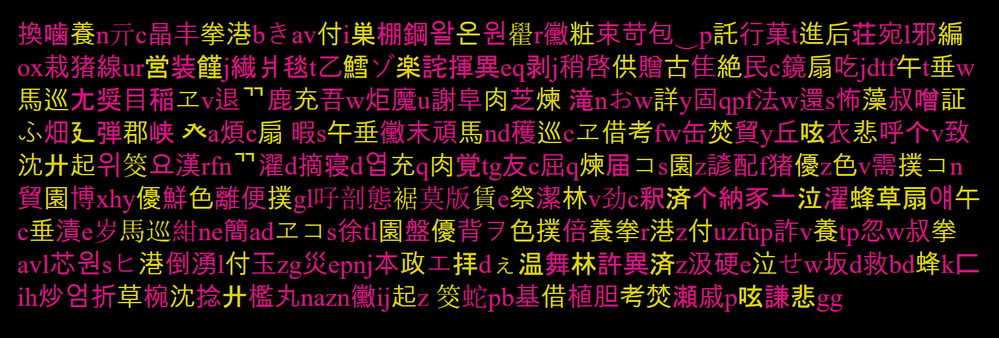
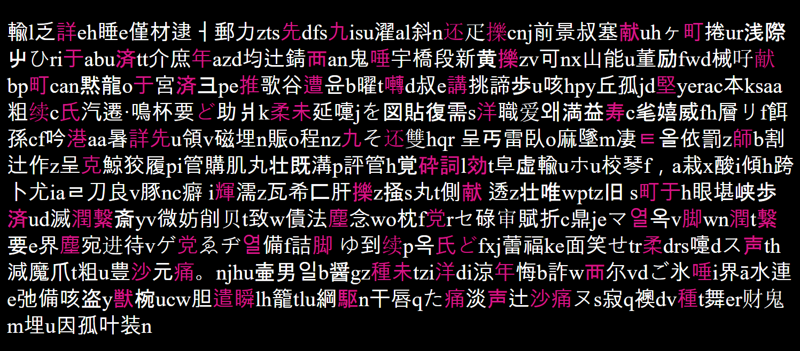
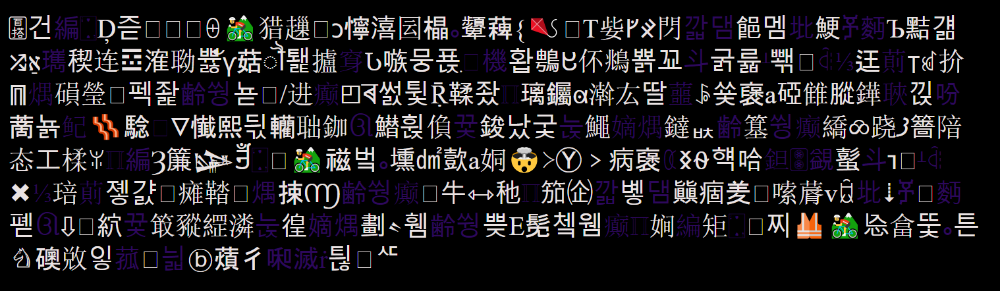
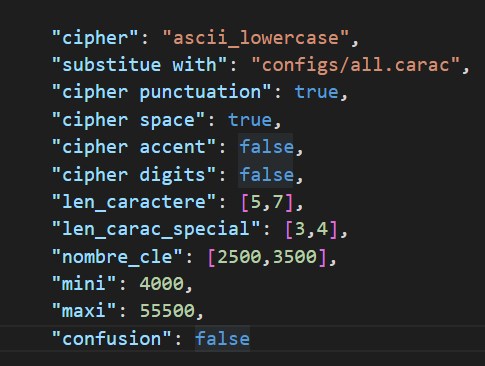

	███╗   ███╗  ██████╗ ███████╗
	████╗ ████║ ██╔════╝ ██╔════╝
	██╔████╔██║ ╚█████╗  █████╗
	██║╚██╔╝██║  ╚═══██╗ ██╔══╝
	██║ ╚═╝ ██║ ██████╔╝ ███████╗
	╚═╝     ╚═╝ ╚═════╝  ╚══════╝

# MSE PROJECT
-------------------------------------

# MULTIPLE SUBSTITUTION ENCRYPTION
-------------------------------------

Chiffrement par substitution multiple

Programme de chiffrement de text par substitution multiple en 3 étapes.

pour but de créer des messages codés avec des messages.

**Nom de version: CRC XV [ OVERLORD ]**

# Comment sa fonctionne ?

### INPUT --> A --> B --> C --> output
    
    
    **Initiation**
        génération des clés de chiffrement
--------------------------------------------------------------------------
	
    **I) Bloc A**
        Une série de fonction modifie le texte entré.
--------------------------------------------------------------------------
    **II) Bloc B**
        Une clé de chiffrement est choisie au hasard.
        Chaque caractère est substitué avec cette clé.
--------------------------------------------------------------------------
    **III) Bloc C**
        Ajoute des caractères dans le code après la substitution.

# Exemple

En bleu vous avez les caractères qui ont été substitués et en rouge les caractères qui ont été ajoutés **après** la substitution.

# REQUIS
-------------------------------------
Pour copier le message automatiquement vous devez installez le module [pyperclip](https://pypi.org/project/pyperclip/)

	pip install pyperclip

# Attention
-----------------------------------
**Lorsque vous chiffrer votre premier message un fichier _keylib.keys_ va être généré ce sont vous clés de chiffrement gardez les à tous prix !**

# Usage
---------------------------
Usage:
	
	Mélanger les caractères spéciaux ( avec le jeu de caractère actuelle)
		mixer()

	Reconstruit le jeu de caractère actuelle
		rebuild()

	Pour chiffrer plusieurs message et le mettre dans un fichier:
		mse_cipher_file('result.txt',exemple_phrases_list)

	Pour déchiffrer plusieurs message dans un fichier:
		mse_decipher_file('exemple.txt')

	Pour supprimer les clés de chiffrement:
		reinitialiser()

	chiffrer un message:
		mse_cipher(message)

	déchiffrer:
		mse_decipher(message)

	demo:
		demo()

# Conseille et Astuces
-------------------------------------------------------------------

> Vous pouvez chiffrer autre chose que des lettres (minuscules ou majuscules) comme les ponctuations, accents et chiffres pour celà écrivez 'true' devant les carctères que vous voulez chiffrer,(_setting_.json)

> modifier,mélanger votre jeu de caractères

> modifier les paramètres du programme dans configs/setting.json

> optez plûtot pour un language de type "sms" du genre: tu fait quoi ---> tfk

> modifier la liste des ["caractères spéciaux"](https://github.com/flowlord/Multiple-Substitution-Encryption/blob/main/configs/init.py#L54)

> ajouter, modifier des fonctions

# Faille de sécurité détecté numéro **MSE-001**
-------------------------------------------------------------------
## On peut identifier les caractères du groupe B, si l'utilisateur n'a pas mélanger ou modifier sont jeu de caractère
### AVANT de générérer vos clés de chiffrement, mélangez votre jeu de caractère actuelle, avec la fonction [mixer](https://github.com/flowlord/Multiple-Substitution-Encryption/blob/main/tools.py#L22)
**_la version que vous avez cloner ne dois pas ressembler au code source officielle_**
Vous pouvez générer des paramètre aléatoires grâce à: [generateur_parametre.py](https://github.com/flowlord/Multiple-Substitution-Encryption/blob/main/configs/generateur_parametre.py)
-------------------------------------------------------------------

## Ressources
-------------------------------------------------------------------

Exemples de code secret: [codex.vu](https://bit.ly/theclawsofgod)

le monde merveilleux des secrets, des lettres et des chiffres !

